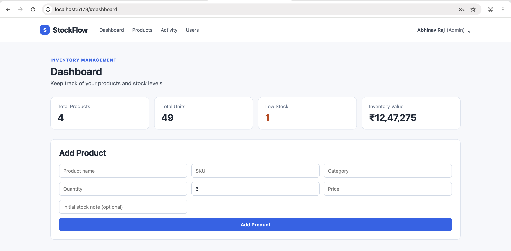
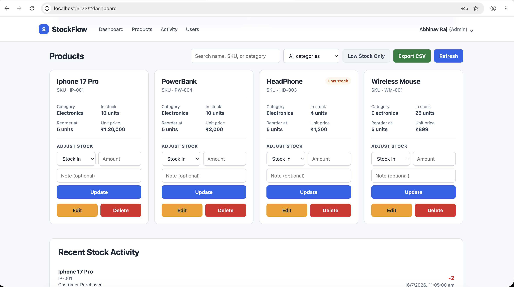
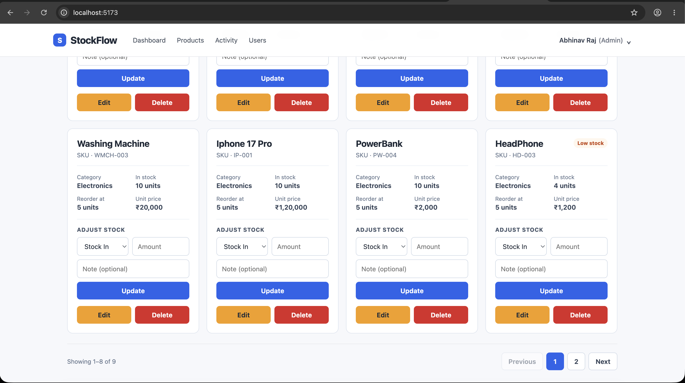
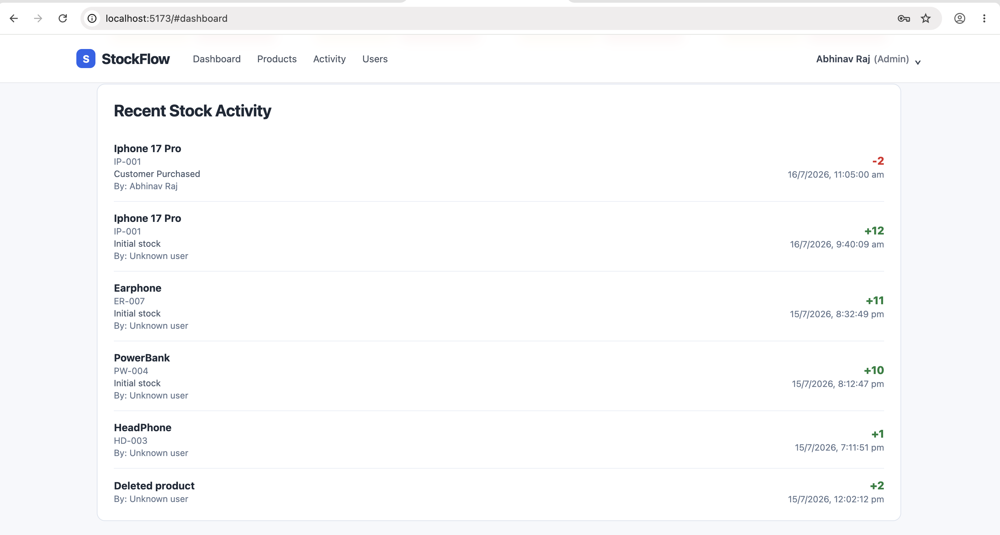

# StockFlow

A full-stack inventory management system built with the MERN stack. StockFlow helps businesses track stock levels, manage product transactions, and control user access through role-based authentication.

**Live Demo:** [https://stockflow-client-jnu9.onrender.com](https://stockflow-client-jnu9.onrender.com)

> Note: The backend is hosted on Render's free tier, so it may take 30-50 seconds to spin up on the first request after a period of inactivity.

## Screenshots

**Dashboard**


**Products**


**Pagination**


**Activity Log**


## Features

- **JWT Authentication** — Secure login and registration system
- **Role-Based Access Control** — Different permissions for admins and regular users
- **Product Management** — Add, edit, and delete inventory items
- **Stock Controls** — Track stock increases/decreases with reason notes
- **Transaction History** — Full audit trail of all stock movements
- **Low Stock Alerts** — Automatic flagging when inventory falls below reorder level
- **Search & Filter** — Find products by name, category, or stock status
- **User Management** — Admin panel to manage user roles
- **Redis Caching** — Server-side caching for product data to reduce database load and speed up repeated requests

## Tech Stack

**Frontend**
- React (Vite)
- CSS

**Backend**
- Node.js
- Express.js
- MongoDB (Mongoose)
- Redis (caching)
- JWT for authentication

**Deployment**
- Frontend: Render (Static Site)
- Backend: Render (Web Service)
- Database: MongoDB Atlas

## Getting Started (Local Setup)

### Prerequisites
- Node.js installed
- MongoDB Atlas account (or local MongoDB instance)
- Redis installed locally (e.g. via Homebrew: `brew install redis`)

### 1. Start Redis
```bash
redis-server
```
Leave this running in its own terminal tab.

### 2. Backend Setup
```bash
cd server
npm install
```

Create a `.env` file in the `server` folder:
```
MONGO_URI=your_mongodb_connection_string
JWT_SECRET=your_jwt_secret
PORT=5050
```

Run the server:
```bash
node server.js
```

### 3. Frontend Setup
```bash
cd client
npm install
```

Create a `.env` file in the `client` folder:
```
VITE_API_URL=http://localhost:5050
```

Run the frontend:
```bash
npm run dev
```

## Author

**Abhinav Raj**
[GitHub](https://github.com/abhinavraj-git)
